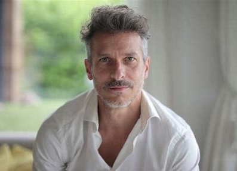

# Personas

As personas desenvolvidas para este projeto são inteiramente fictícias. No entanto, é importante ressaltar que elas foram inspiradas em situações reais vivenciadas por colegas e familiares. A fim de criar personagens mais autênticos e representativos, coletamos informações valiosas através de perguntas diretas e conversas casuais com pessoas próximas.
Essas interações informais nos permitiram entender melhor as diversas experiências, desafios, emoções e objetivos que pessoas à nossa volta enfrentam no cotidiano. Ao reunir esses insights, conseguimos construir estas personas que,mesmo não sendo reais, refletem de maneira fiel as situações da vida real.

---

## Persona 1

Nome: João Silva  
Idade: 35 anos  
Profissão: Analista de TI  
Localização: Sobradinho, DF 
Descrição: 
- Embora sempre tome café forte, adora dar uma cochiladinha no ônibus a caminho do trabalho, por isso evita horários de pico para conseguir um assento.
- Gosta de assistir filmes, jogar futebol com os colegas de trabalho e principalmente dormir.
- Prefere usar o transporte público por medo e também economia de dinheiro, prioriza valorizar seu imovel ao invés da compra de um carro.

Situação: João mora em Sobradinho e trabalha na Asa Norte. Ele depende do transporte público diariamente para ir e voltar do trabalho.

Objetivos:
- Encontrar as rotas mais rápidas para evitar atrasos no trabalho.
- Monitorar atrasos e interrupções no serviço de transporte.
- Economizar tempo e dinheiro com o transporte público.

Frustrações:
- Superlotação nos horários de pico.
- Falta de informação atualizada sobre o transporte.
- Dificuldade em encontrar rotas alternativas rapidamente.

Uso do Moovit:
- Utiliza o aplicativo para planejar sua viagem todos os dias.
- Verifica horários e atrasos em tempo real.
- Usa o Moovit para encontrar rotas alternativas quando há interrupções no serviço.

---

# Persona 2

Nome: Maria Oliveira  
Idade: 22 anos  
Profissão: Estudante de Engenharia  
Localização: Rio de Janeiro, RJ  
Descrição: Leonina, Vascaína, praticante de Muay Thai, gosta de cerveja e de ler livros na praia e de visitar os avós que vivem em Niterói.

Situação: Maria estuda na UFRJ e mora na Barra da Tijuca. Ela precisa pegar um ônibus para chegar à universidade e para ir visitar os avós que moram longe.

Objetivos:
- Chegar às aulas a tempo, especialmente para as provas.
- Encontrar a rota mais eficiente e econômica.
- Explorar a cidade e visitar amigos durante o fim de semana.
- Passar um tempo na casa dos avós quando está de férias.

Frustrações:
- Horários irregulares dos ônibus.
- Longos tempos de espera por transporte.
- Dificuldade em encontrar o transporte certo para eventos e locais diferentes.

Uso do Moovit:
- Planeja suas viagens para a universidade, eventos sociais e visitas.
- Verifica os horários dos ônibus.
- Descobre rotas e opções mais rápidas com menos paradas e trocas de ônibus para ir até Niterói

---

# Persona 3

Nome: Carlos Rodríguez  
Idade: 45 anos  
Profissão: Empresário 
Localização: Buenos Aires, Argentina (visitando São Paulo)  
Descrição: Mais tiozão que ele impossível, adora influenciar seu sobrinho de 16 anos a torcer para o Boca Juniors e assistir ao Masterchef. Carlos embora seja dono de uma franquia de academias de Buenos Aires adora culinária e gostaria de ir aos restaurantes mais privilegiados de São Paulo.

Situação: Carlos está visitando São Paulo pela primeira vez para uma conferência. Ele não fala português fluentemente e quer aproveitar a cidade.

Objetivos:
- Navegar pela cidade sem se perder.
- Encontrar pontos turísticos e restaurantes.
- Maximizar seu tempo durante a estadia curta.

Frustrações:
- Barreiras linguísticas ao usar transporte público.
- Dificuldade em entender mapas e sinais locais.
- Incerteza sobre a segurança em diferentes áreas.

Uso do Moovit:
- Usa o aplicativo para orientação passo a passo em seu idioma.
- Acessa informações sobre pontos turísticos e transporte.
- Encontra rotas seguras e rápidas para explorar a cidade.

---

# Persona 4

Nome: Ana Ferreira  
Idade: 68 anos  
Profissão: Aposentada  
Localização: Juiz de Fora, MG  
Descrição:
-  Aura de “Deputada”, simpática e gosta de falar com todo mundo.
- No quesito do uso de tecnologias, só sabe usar o WhatsApp. Ficou relutante em usar o Moovit por achar complexo demais, mas passou a utilizá-lo devido à insistência de seu neto.
- Embora saia muito de casa, faz de tudo para passar o maior tempo possível ao lado do seu adorável cachorro Rex.

Situação: Ana é aposentada, mas gosta de manter-se ativa, participando de atividades sociais, visitando amigos e familiares e frequentando a igreja.

Objetivos:
- Manter-se independente usando transporte público.
- Participar de atividades sociais e comunitárias.
- Visitar seus filhos e netos que moram em diferentes partes da cidade.

Frustrações:
- Dificuldade em andar longas distâncias.
- Confusão com mudanças frequentes nos horários de ônibus.
- Preocupação com segurança durante a noite.

Uso do Moovit:
- Planeja suas viagens com antecedência para garantir a melhor rota.
- Usa o aplicativo para evitar ficar muito tempo esperando na parada de ônibus.
- Usa o aplicativo para monitorar horários e mudanças no transporte.
- Verifica opções de transporte acessível.
