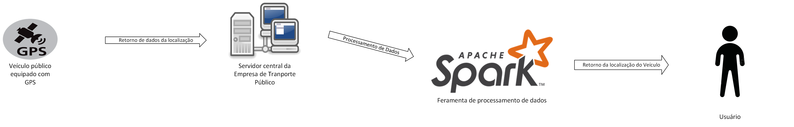

## RichPicture oque é?

É uma ferramenta visual poderosa e flexível que ajuda na compreensão e na gestão de sistemas complexos, promovendo uma visão ampla e integrada que pode ser explorada e analisada por diferentes partes interessadas.

Abaixo serão listadas os Rich Pictures para cada escopo do sistema Moovit.

### Sistema de Rastreamento

