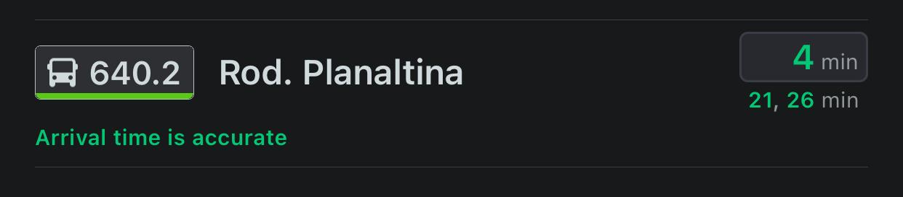
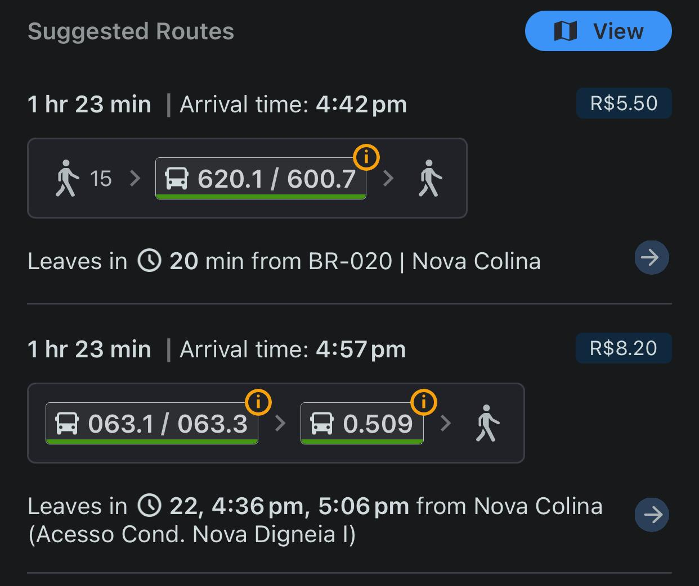
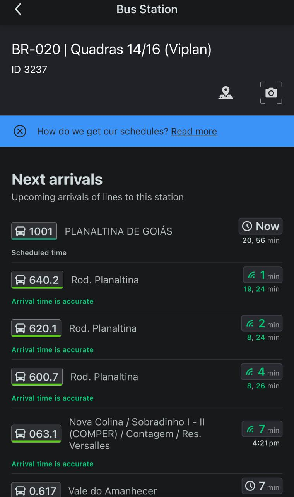
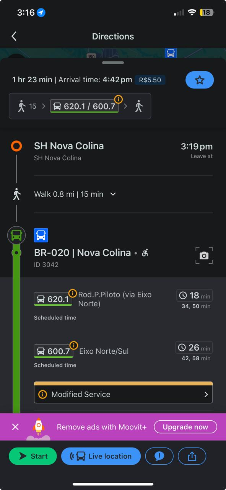
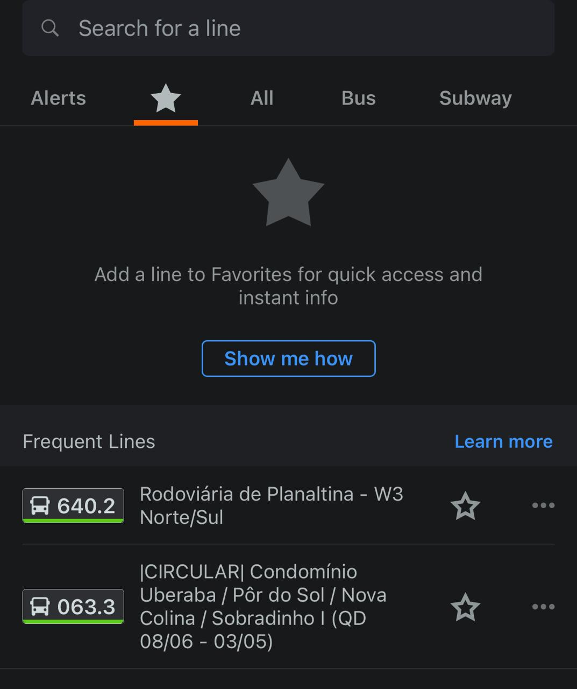
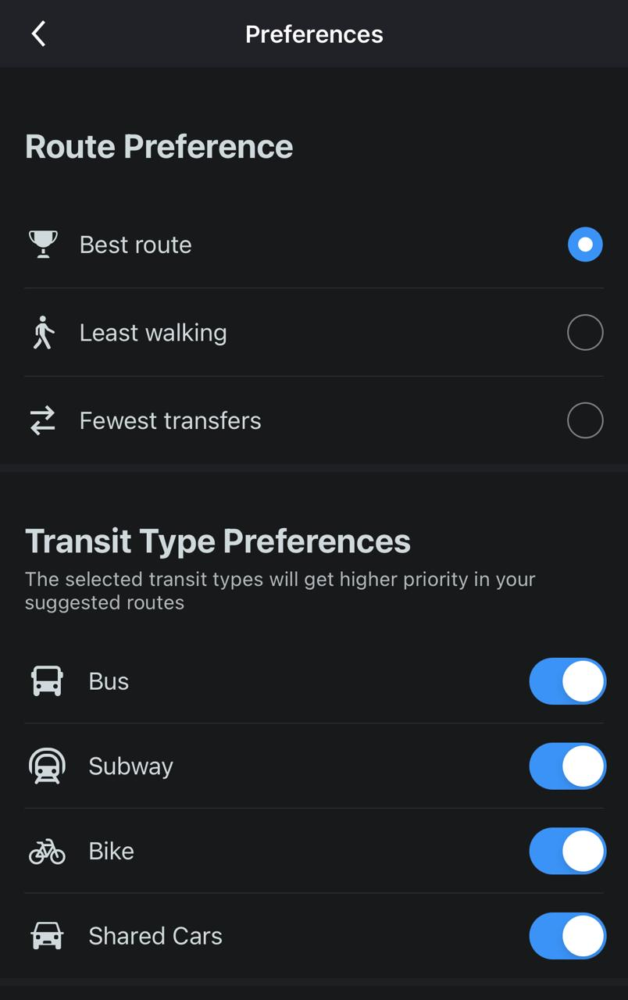
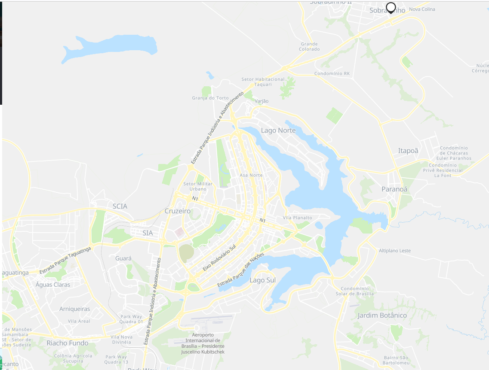
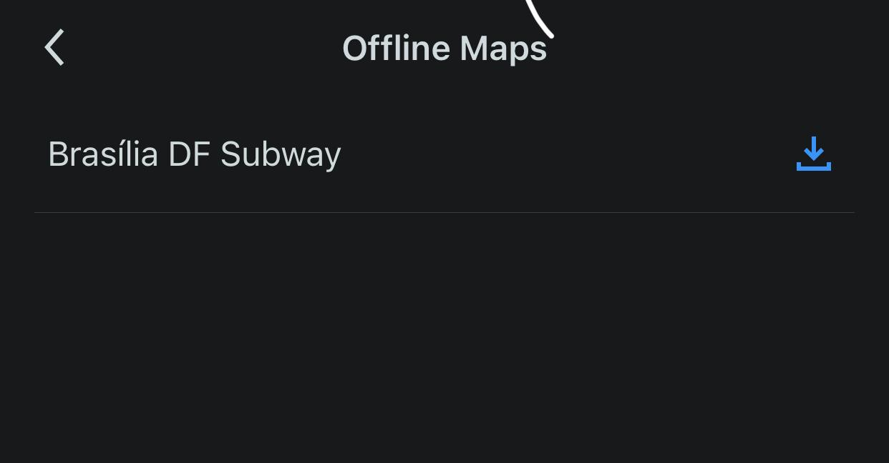
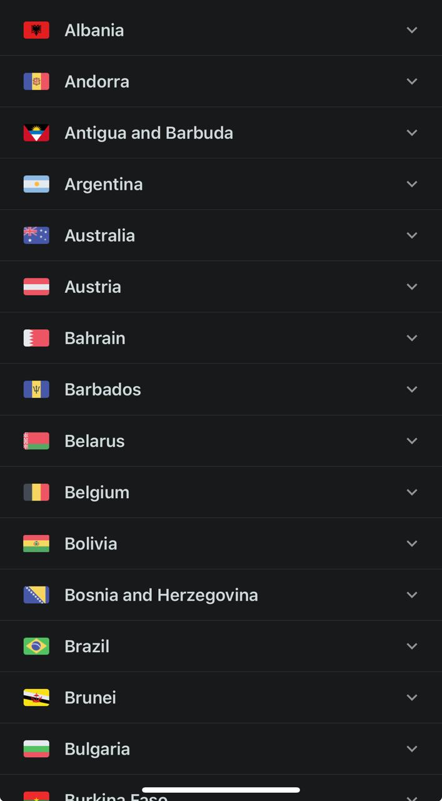
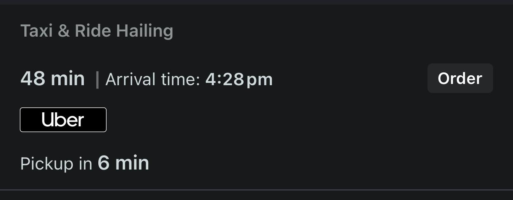

# Forward From

O objetivo do Forward From é garantir que todos os requisitos originais sejam corretamente endereçados e atendidos ao longo do desenvolvimento do projeto, permitindo uma visão clara de como cada requisito contribui para o produto final.

## Metodologia
- **Identificação dos Requisitos:** Confirmar que cada requisito tem um identificador único e uma descrição.
- **Funcionalidade:** Assegurar que as funcionalidades desenvolvidas correspondem aos requisitos especificados.
- **Mapeamento dos Artefatos:** Checar se os artefatos relacionados estão corretamente alinhados com o requisito.

## Tabela de Requisitos Funcionais

| ID  | Descrição | Funcionalidade | Artefato |
|----------|---------------|------------|------|
RF01 | Permitir que os usuários busquem rotas de transporte público. |    | [CN1](../Modelagem/CenarioLex.md), [CN5](../Modelagem/CenarioLex.md), [UC001](../Modelagem/especificacaocasouso.md), [US111](../Agil/backlog.md), [US311](../Agil/backlog.md) |
RF02 |Fornecer informações em tempo real sobre horários de chegada dos ônibus. |    |  [CN7](../Modelagem/CenarioLex.md), [US211](../Agil/backlog.md)|
RF03 |Exibir diferentes rotas de transporte público disponíveis para um determinado destino. |    | [CN1](../Modelagem/CenarioLex.md), [UC001](../Modelagem/especificacaocasouso.md) |
RF04 |Permitir que os usuários visualizem a localização dos veículos de transporte público em tempo real.|    | [CN7](../Modelagem/CenarioLex.md), [US211](../Agil/backlog.md)|
RF05 |Fornecer informações sobre as linhas de transporte público e suas paradas. |    | [CN5](../Modelagem/CenarioLex.md), [UC001](../Modelagem/especificacaocasouso.md) |
RF06 |Permitir a navegação passo a passo para os usuários chegarem ao seu destino. |    | [CN1](../Modelagem/CenarioLex.md), [CN5](../Modelagem/CenarioLex.md), [CN8](../Modelagem/CenarioLex.md), [UC001](../Modelagem/especificacaocasouso.md) |
RF07 |Permitir que os usuários salvem suas linhas favoritas.|    |  [US121](../Agil/backlog.md)|
RF08 |Permitir que os usuários filtrem suas preferências de rotas e modos de transporte.|    | [CN8](../Modelagem/CenarioLex.md), [CN4](../Modelagem/CenarioLex.md), [CN2](../Modelagem/CenarioLex.md), [UC008](../Modelagem/especificacaocasouso.md), [US112](../Agil/backlog.md), [US122](../Agil/backlog.md) |
RF09 |Permitir que os usuários relatem problemas ou atualizações sobre rotas e horários.|    | [CN9](../Modelagem/CenarioLex.md), [CN11](../Modelagem/CenarioLex.md), [UC009](../Modelagem/especificacaocasouso.md), [UC002](../Modelagem/especificacaocasouso.md), [US521](../Agil/backlog.md) |
RF10 |Fornecer dados de tráfego e condições das vias para melhor planejamento de rotas.| moovit+   | [CN10](../Modelagem/CenarioLex.md), [US212](../Agil/backlog.md), [US213](../Agil/backlog.md), [US222](../Agil/backlog.md), [US231](../Agil/backlog.md) |
RF11 |Sistema de geolocalização para rastreamento preciso dos usuários e veículos.|    | [US113](../Agil/backlog.md) |
RF12 |Permitir a personalização de notificações de horários e alertas de transporte.|    | [CN10](../Modelagem/CenarioLex.md), [US212](../Agil/backlog.md), [US221](../Agil/backlog.md), [US223](../Agil/backlog.md), [US224](../Agil/backlog.md) |
RF13 |Integrar soluções de IA para otimizar o planejamento e a operação dos transportes.| moovit+    |  |
RF14 |Suportar modo offline para acessar informações básicas de rotas e paradas.|    |  [US321](../Agil/backlog.md), [US322](../Agil/backlog.md) |
RF15 |Fornecer suporte multilíngue para usuários de diferentes regiões.|    | [US551](../Agil/backlog.md) |
RF16 |Suportar integração com serviços de carona paga para fornecer opções de transporte.|    | [CN4](../Modelagem/CenarioLex.md), [UC008](../Modelagem/especificacaocasouso.md), [US411](../Agil/backlog.md) |

## Tabela de Requisitos Não Funcionais

| ID | Descrição | Funcionalidade | Artefato | 
-----|-----|--------|-------------------|
RNF01| O sistema deve ser responsivo, adaptando-se a diferentes tamanhos de tela (dispositivos móveis e tablets).|   Usuários em sua grande parte aprovam.  |   [NFR004](../Modelagem/NFR-Framework.md)  |
RNF02|O sistema deve ser compatível com as principais versões dos sistemas operacionais Android e iOS.|   “A solução está disponível para Android, iPhone e na versão Web” segundo o site do moovit <https://moovit.com/pt/maas-solutions-pt/branded-apps/>  |  [NFR004](../Modelagem/NFR-Framework.md)   |
RNF03|A interface do usuário deve ser intuitiva e fácil de usar, seguindo as diretrizes de design de UX/UI.|  Por análise de uso esse requisito foi atendido pela maioria das partes   |  [NFR004](../Modelagem/NFR-Framework.md)   |
RNF04|O sistema deve seguir as condições de LGPD para a compra de assinaturas.|   Por se implantado no Brasil, é obrigatório que esse requisito seja atendido  |   [NFR004](../Modelagem/NFR-Framework.md)  |
RNF05|O sistema deve ser escalável sendo possível utilizar em qualquer região.|   Por ser um aplicativo global atendendo várias regiões esse requisito foi atendido  |  [NFR004](../Modelagem/NFR-Framework.md)   |
