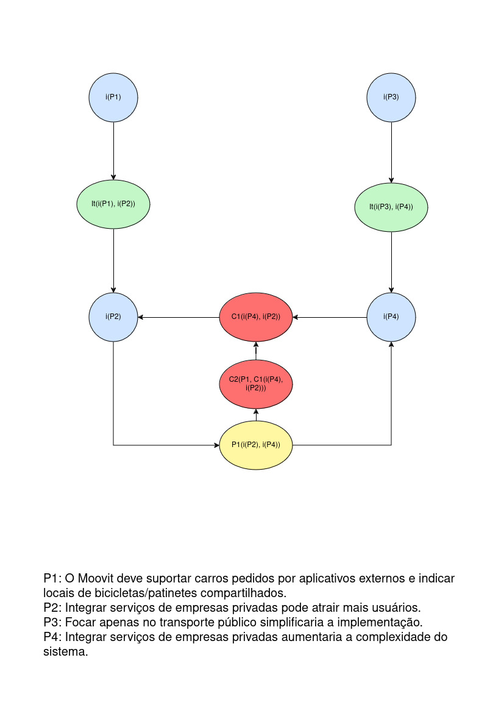

# Argumentação - Grafos ACE

é um modelo formal para representar e avaliar discussões, debates ou raciocínios complexos, utilizando a estrutura de grafos. Um grafo, neste contexto, é uma representação gráfica composta por nós (ou vértices) e arestas (ou arcos), onde:

Nós (Vértices) representam argumentos individuais.
Arestas (Arcos) representam relações entre esses argumentos, como ataques, suportes ou refutações.

O objetivo da argumentação com grafos é determinar quais argumentos são aceitáveis em uma discussão, considerando as relações entre eles. Vários métodos podem ser usados para isso, incluindo:

Extensões de Argumentos: Conjuntos de argumentos que podem ser considerados aceitáveis juntos, sem contradições internas.
Semânticas de Argumentação: Regras formais que definem como os argumentos e suas interações devem ser avaliados (ex: semânticas de estabilidade, preferibilidade, etc.).

| Autor | Versão | Data|
|--|---|---|
|Diego Carlito| 1ª| 31/07/2024|