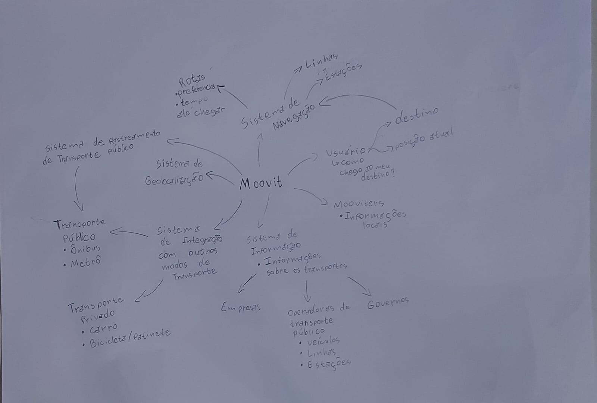

# Brainstorm

é uma técnica colaborativa usada para coletar ideias e identificar necessidades durante a fase de definição de requisitos de um projeto. Reúne a equipe para discutir, sugerir e refinar ideias, sem julgamentos iniciais, com o objetivo de capturar todas as possíveis funcionalidades, características e restrições do sistema.

Dentro da nossa primeira reunião tivemos esse resultado:

---

| Autor | Versão | Data|
|--|---|---|
|Diego Carlito| 1ª| 28/07/2024|