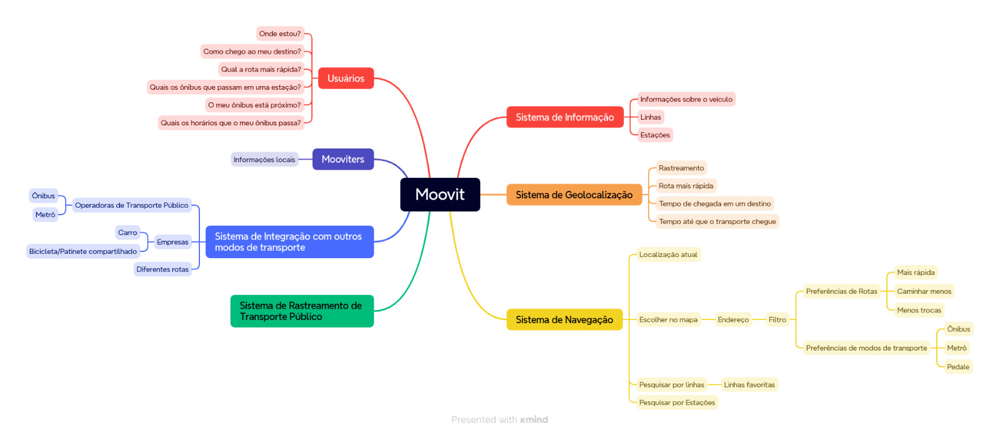

# Mapa Mental oque é?

Um mapa mental é uma ferramenta visual que organiza informações de maneira hierárquica e clara, e no contexto da rastreabilidade dos requisitos de software, desempenha várias funções importantes compondo: 

O encontro do escopo se deu por algumas técnicas: Introspeção pelos próprios alunos que utilizam o sistema, pesquisa na aba [sobre o moovit](https://moovit.com/pt/about-us-pt/) no site oficial.

Abaixo serão listadas os Rich Pictures para cada escopo do sistema Moovit.

## Sistema Moovit

**Mapa Mental**

