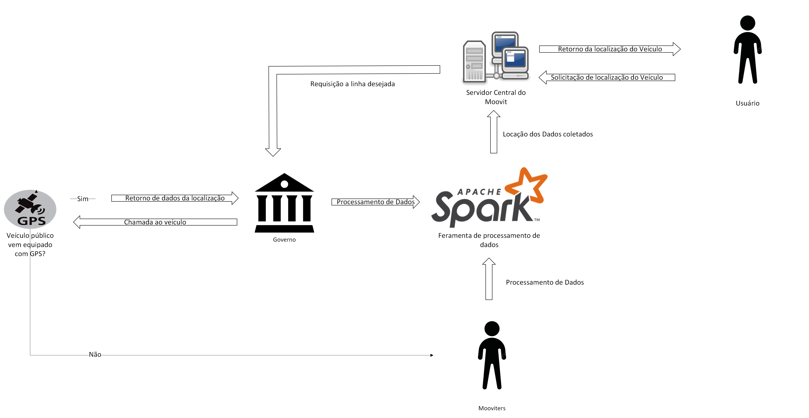

# RichPicture oque é?

É uma ferramenta visual poderosa e flexível que ajuda na compreensão e na gestão de sistemas complexos, promovendo uma visão ampla e integrada que pode ser explorada e analisada por diferentes partes interessadas.

O encontro do escopo se deu por algumas técnicas: Introspeção pelos próprios alunos que utilizam o sistema, pesquisa na aba [sobre o moovit](https://moovit.com/pt/about-us-pt/) no site oficial.

Para iniciar o desenvolvimento do Rich Picture geral, o primeiro passo foi
analisar minuciosamente o documento contendo o escopo do projeto, elaborado
durante uma reunião virtual realizada em 27/07/2024. Após uma análise cuidadosa,
foi realizada uma pesquisa aprofundada na internet em sites que contêm informações
relevantes sobre o Moovit e seu desenvolvimento. As fontes consultadas incluem:

* https://moovit.com/pt/about-us-pt/
* https://moovitapp.com/index/pt-br/transporte_p%C3%BAblico-Brasilia-1702
* https://canaltech.com.br/empresa/moovit/
* https://moovitapp.com/index/pt-br/transporte_p%C3%BAblico-lines-Brasilia-1702-2747911
* https://moovit.com/pt/maas-solutions-pt/timepro/

Abaixo serão listadas os Rich Pictures para cada escopo do sistema Moovit.

Esses sites foram fundamentais para a construção do esqueleto inicial do Rich
Picture sobre o Moovit, pois fornecem informações abrangentes sobre a história da
empresa, suas funcionalidades e demais aspectos relevantes.

## Sistema Moovit

|Autor| Versão          |Data| Descrição |
|----|----|---------- |-----|
|Pedro Paulo| 1ª | 28/07/2024 |Os sites listados foram fundamentais para a construção do esqueleto inicial do Rich Picture sobre o Moovit, pois fornecem informações abrangentes sobre a história da empresa, suas funcionalidades e demais aspectos relevantes.|

|Autor| Versão          |Data| Descrição |
|----|----|---------- |-----|
|Diego Carlito| 2ª | 29/07/2024 |Utilizando o primeiro Rich Picture como referência, foram adicionados mais detalhes sobre a obtenção de informações de geolocalização pelo Moovit, bem como a especificação de como os dados sobre transportes públicos seriam coletados.|

|Autor| Versão          |Data| Descrição |
|----|----|---------- |-----|
|Pedro Paulo| 3ª | 29/07/2024 |Após alguns dias de análise e pesquisa no próprio aplicativo e no cenáriocriado pelo grupo, surgiu um novo esquema de como poderia ser o Rich Picture geral do app. Para alcançar esse artefato, foram realizadas pesquisas na seção "Sobre nós", presente no próprio aplicativo, em uma de suas áreas de informação. Essa seção continha informações sobre como os usuários poderiam utilizar o aplicativo e quem são os "Mooviters" — pessoas que informam ao aplicativo os horários em que determinados ônibus costumam passar em uma parada específica, quando a localização no veículo não está ativa. Além disso, foi possível identificar qual sistema de geolocalização é utilizado para obter a API, entre outras informações relevantes.Para a criação do segundo Rich Picture, foram utilizados os seguintes arquivos:|

### Sistema de Rastreamento
---

|Autor  | Versão          |Data| Descrição |
|-------|-----------------|----|---------- |
|Márcio Henrique| 1ª   |27/07/2024| É extraido do site oficial que o sistema contém uma aplicação de rastreamento, o mesmo é agredado com as informações obtidas pela empresa de transporte público responsável, ou os próprios mooviters que ajudam a sempre estarem atualizando sobre as linhas.|

--- 

---

| Autor| Versão          |Data| Descrição |
|------|-----------------|-----|---------- |
|Márcio Henrique| 2ª        |29/07/2024 | Após debates com a equipe e o enquadramento do mapa mental, foi revelado algumas inconsistências nos fluxos   entre os componentes ( além do novo componente "mooviters" ), então obtivemos esse resultado.|

---

