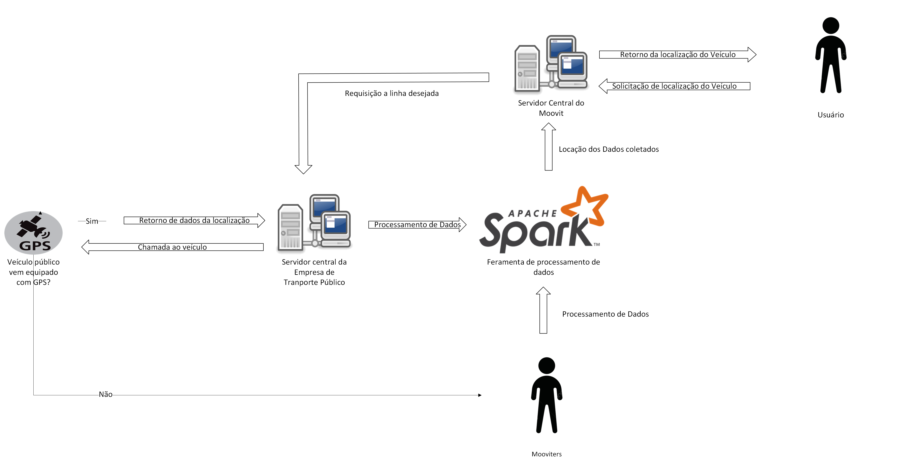

# RichPicture oque é?

É uma ferramenta visual poderosa e flexível que ajuda na compreensão e na gestão de sistemas complexos, promovendo uma visão ampla e integrada que pode ser explorada e analisada por diferentes partes interessadas.

O encontro do escopo se deu por algumas técnicas: Introspeção pelos próprios alunos que utilizam o sistema, pesquisa na aba [sobre o moovit](https://moovit.com/pt/about-us-pt/) no site oficial.

Abaixo serão listadas os Rich Pictures para cada escopo do sistema Moovit.

## Sistema Moovit

| Versão          | Descrição |
|----|---------- |
| 1ª | Descrição |

### Sistema de Rastreamento
---

|Autor  | Versão          |Data| Descrição |
|-------|-----------------|----|---------- |
|Márcio Henrique| 1ª   |27/07/2024| É extraido do site oficial que o sistema contém uma aplicação de rastreamento, o mesmo é agredado com as informações obtidas pela empresa de transporte público responsável, ou os próprios mooviters que ajudam a sempre estarem atualizando sobre as linhas.|

--- 

---

| Autor| Versão          |Data| Descrição |
|------|-----------------|-----|---------- |
|Márcio Henrique| 2ª        |29/07/2024 | Após debates com a equipe e o enquadramento do mapa mental, foi revelado algumas inconsistências nos fluxos   entre os componentes ( além do novo componente "mooviters" ), então obtivemos esse resultado.|

---

